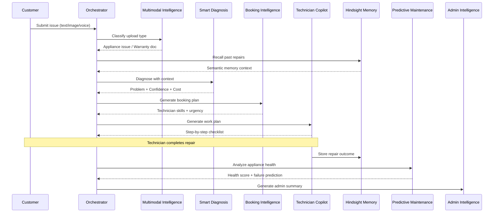

# FixNow — AI Workflows

## Overview

FixNow operates 7 autonomous AI workflows, orchestrated by a central pipeline. Each workflow receives structured input, calls the Groq LLM via the Vercel AI SDK, and returns strictly-typed JSON validated by Zod schemas.

## Workflow Pipeline

## Workflow Details

### 1. Multimodal Service Intelligence
**Location:** `src/features/multimodal/`

Classifies uploaded images as either appliance issues or warranty documents. Uses vision AI to determine the upload type before routing to the appropriate pipeline.

### 2. Smart Diagnosis
**Location:** `src/features/diagnosis/`

Converts raw customer problem text into structured diagnosis JSON containing:
- Problem description
- Confidence score (0-1)
- Required technician category
- Urgency level (Low/Medium/High)
- Estimated cost range
- Recommended materials

### 3. Booking Intelligence
**Location:** `src/features/booking-ai/`

Maps diagnosis output to booking parameters:
- Recommended technician specialization
- Required tools and parts
- Priority scoring
- Optimal scheduling

### 4. Technician Copilot
**Location:** `src/features/technician-copilot/`

Generates on-site support for technicians:
- Step-by-step repair guide
- Safety hazards
- Required parts checklist
- Post-repair customer advice

### 5. Predictive Maintenance
**Location:** `src/features/predictive-maintenance/`

Calculates appliance health using repair history from Hindsight memory:
- Health score (0-100)
- Failure probability
- Estimated days to next failure
- Warning signs

### 6. Operations & Admin Intelligence
**Location:** `src/features/admin-intelligence/`

Generates executive summaries from platform activity:
- Technician performance rankings
- Customer risk assessment
- Recurring fault pattern detection
- Revenue and efficiency metrics

### 7. Orchestration Layer
**Location:** `src/features/orchestration/`

Central coordinator that:
- Routes triggers to the correct workflow
- Chains workflow outputs as inputs
- Manages Hindsight memory recall/retain
- Validates all inputs/outputs via Zod
