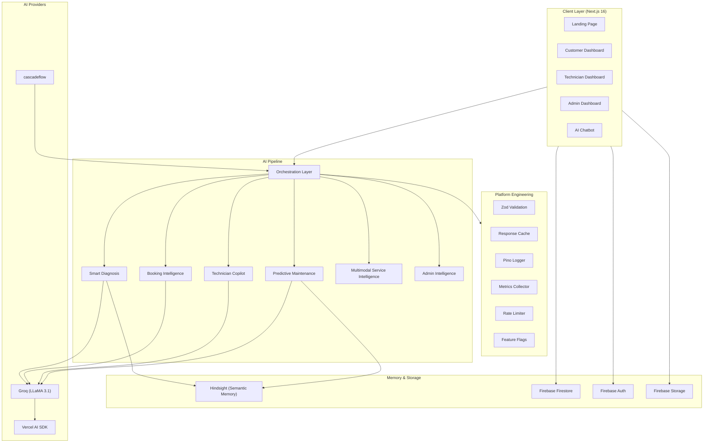

# FixNow — System Architecture

## Overview

FixNow is a full-stack home services platform built on Next.js 16, Firebase, and a multi-model AI pipeline. The platform connects customers with verified technicians for appliance repair, using AI to diagnose issues, recommend specialists, and predict future failures.

## Architecture Diagram

## Data Flow

1. **Customer reports issue** → Text/image/voice input → Multimodal Service Intelligence classifies the upload
2. **Smart Diagnosis** → Groq LLM analyzes the issue, queries Hindsight for past repairs on this appliance
3. **Booking Intelligence** → Maps diagnosis output to technician skills, tools, and urgency
4. **Technician Copilot** → Generates step-by-step repair checklist for the assigned technician
5. **Predictive Maintenance** → After repair, calculates future failure probability using repair history from Hindsight
6. **Admin Intelligence** → Aggregates platform-wide metrics for executive dashboards

## Key Design Decisions

- **Groq over OpenAI**: Chosen for speed (sub-200ms inference) and cost efficiency for structured output generation
- **Hindsight Vector Memory**: Enables semantic recall of past repairs, making each diagnosis contextually aware
- **cascadeflow**: Routes complex multi-step AI workflows with automatic fallback and retry logic
- **Zod Everywhere**: Every AI input and output is validated against strict schemas, preventing hallucination-induced crashes
