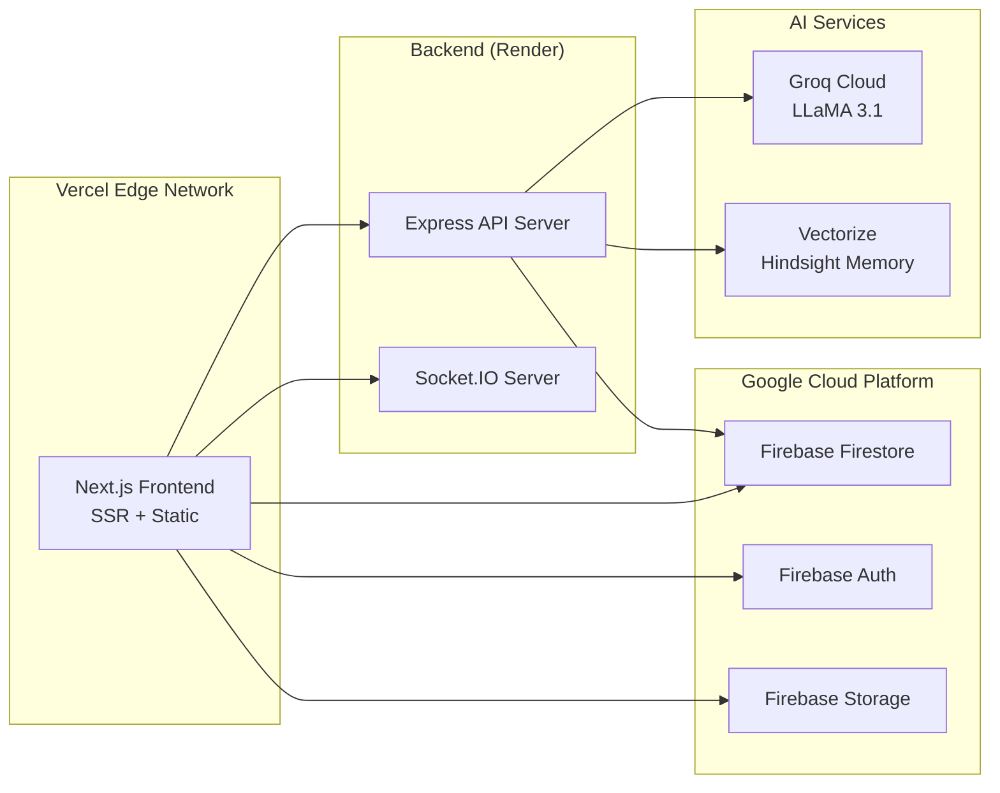

# FixNow — Deployment Guide

## Prerequisites

- Node.js 18+ 
- npm 9+
- Firebase project with Firestore, Auth, and Storage enabled
- Groq API key
- Hindsight (Vectorize) API key
- Vercel account (for production deployment)

## Environment Variables

Create a `.env.local` file in the `frontend/` directory:

```env
# ─── AI Providers ───
GROQ_API_KEY=gsk_...

# ─── Firebase ───
NEXT_PUBLIC_FIREBASE_API_KEY=AIza...
NEXT_PUBLIC_FIREBASE_AUTH_DOMAIN=your-project.firebaseapp.com
NEXT_PUBLIC_FIREBASE_PROJECT_ID=your-project-id
NEXT_PUBLIC_FIREBASE_STORAGE_BUCKET=your-project.appspot.com
NEXT_PUBLIC_FIREBASE_MESSAGING_SENDER_ID=123456789
NEXT_PUBLIC_FIREBASE_APP_ID=1:123456789:web:abc123

# ─── Backend API ───
NEXT_PUBLIC_API_BASE=https://your-backend.onrender.com
NEXT_PUBLIC_SOCKET_URL=https://your-backend.onrender.com

# ─── Google Maps ───
NEXT_PUBLIC_GOOGLE_MAPS_KEY=AIza...

# ─── Hindsight (Semantic Memory) ───
HINDSIGHT_API_KEY=hs_...

# ─── Feature Flags ───
NEXT_PUBLIC_FF_VOICE_ENABLED=true
NEXT_PUBLIC_FF_MULTIMODAL_ENABLED=true
NEXT_PUBLIC_FF_HINDSIGHT_ENABLED=true
```

## Local Development

```bash
cd frontend
npm install
npm run dev
```

The dev server starts on `http://localhost:3001` (configured in package.json).

## Production Build

```bash
cd frontend
npm run build
npm run start
```

## Vercel Deployment

### 1. Connect Repository
Link your GitHub repository to Vercel.

### 2. Configure Build Settings
- **Framework Preset**: Next.js
- **Root Directory**: `frontend`
- **Build Command**: `next build`
- **Output Directory**: `.next`
- **Node.js Version**: 18.x

### 3. Environment Variables
Add all variables from the `.env.local` template above to the Vercel project settings.

### 4. Deploy
Push to `main` branch to trigger automatic deployment.

## Deployment Topology



## Pre-Flight Checklist

- [ ] All environment variables configured
- [ ] `npm run lint` passes with no errors
- [ ] `npm run build` completes successfully
- [ ] Firebase Firestore rules reviewed
- [ ] Firebase Auth providers enabled (Email/Password, Google)
- [ ] Groq API rate limits sufficient for expected traffic
- [ ] Hindsight vector search extension enabled
- [ ] Google Maps API key has correct domain restrictions
- [ ] Socket.IO CORS configured for production domain
