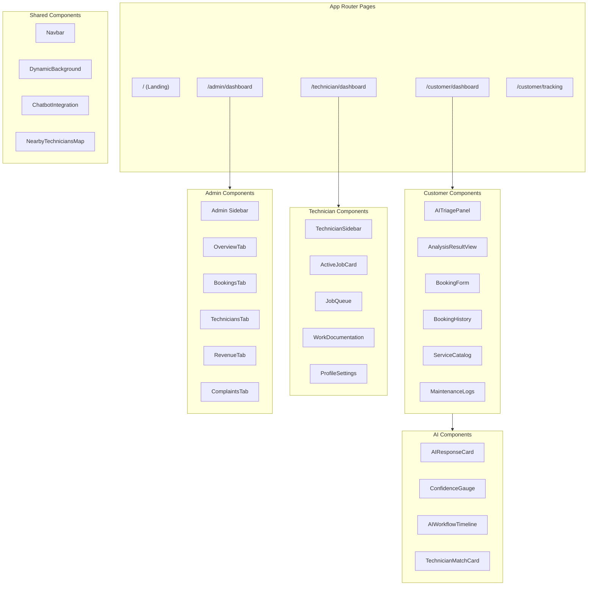

# FixNow — System Design

## Design Principles

1. **AI-First Architecture**: Every user interaction is enhanced by AI reasoning
2. **Semantic Memory**: The platform gets smarter with every repair via Hindsight vector recall
3. **Real-Time**: Firebase listeners + Socket.IO provide instant state updates
4. **Type Safety**: Zod validates every boundary — API inputs, AI outputs, Firebase data
5. **Glassmorphism UI**: Premium dark theme with depth, blur, and subtle glow effects

## Component Architecture



## State Management

FixNow uses **no global state library**. Instead:

- **Firebase `onSnapshot`** provides real-time reactive state for database-backed data
- **React `useState` / `useEffect`** manages local component state
- **Custom hooks** (`useDashboardData`, `useBooking`, `useTechnicianData`) encapsulate data fetching logic
- **Socket.IO** handles real-time events (broadcast bookings, technician acceptance)

## Data Flow Patterns

### Customer Issue Flow
1. Customer types/speaks/uploads issue → `AITriagePanel`
2. `useBooking.handleAnalyze()` sends to backend AI endpoint
3. Backend runs orchestration pipeline (Diagnosis → Booking → Copilot)
4. Results render in `AnalysisResultView` with `AIResponseCard`
5. Customer selects technician → `BookingForm` collects details
6. Booking saved to Firestore → Socket.IO broadcasts to technicians

### Technician Assignment Flow
1. Socket.IO broadcasts booking to eligible technicians
2. First technician to accept gets the job
3. `ActiveJobCard` displays AI-generated work plan
4. Technician documents completion via `WorkDocumentation`
5. Repair outcome stored in Hindsight memory

## File Structure

```
frontend/src/
├── app/                    # Next.js App Router
│   ├── admin/              # Admin dashboard & routes
│   ├── api/                # API route handlers
│   ├── auth/               # Authentication pages
│   ├── customer/           # Customer dashboard & routes
│   ├── technician/         # Technician dashboard & routes
│   ├── services/           # Service catalog pages
│   ├── globals.css         # Design system
│   ├── layout.tsx          # Root layout
│   └── page.tsx            # Landing page
├── components/             # Reusable components
│   ├── admin/              # Admin-specific components
│   ├── ai/                 # AI visualization components
│   ├── chat/               # Chatbot components
│   ├── customer/           # Customer-specific components
│   ├── landing/            # Landing page components
│   ├── technician/         # Technician-specific components
│   └── ui/                 # Primitive UI components
├── features/               # AI workflow implementations
│   ├── admin-intelligence/ # Admin analytics AI
│   ├── booking-ai/         # Booking intelligence
│   ├── diagnosis/          # Smart diagnosis
│   ├── multimodal/         # Image/document classification
│   ├── orchestration/      # Central workflow coordinator
│   ├── predictive-maintenance/ # Failure prediction
│   └── technician-copilot/ # Repair guidance AI
├── hooks/                  # Custom React hooks
├── lib/                    # Utilities & services
│   ├── ai/                 # AI service layer
│   ├── platform/           # Platform engineering layer
│   ├── firebase.ts         # Firebase configuration
│   └── config.ts           # API configuration
└── server/                 # Server-side utilities
```
